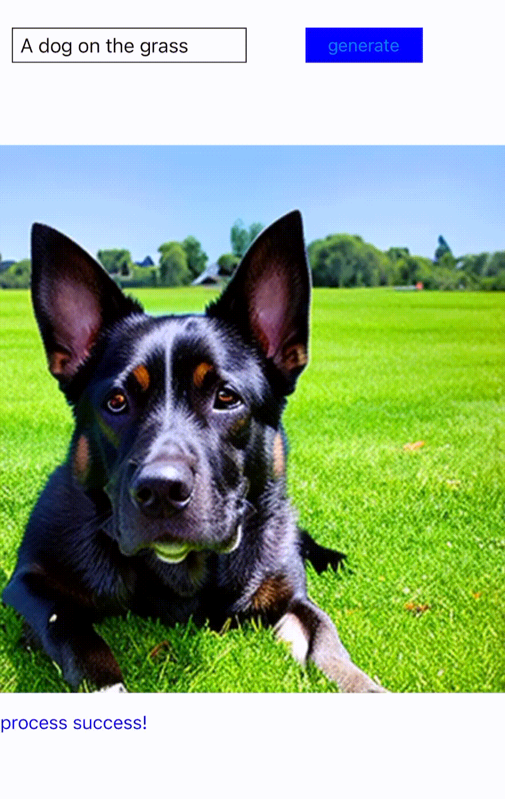
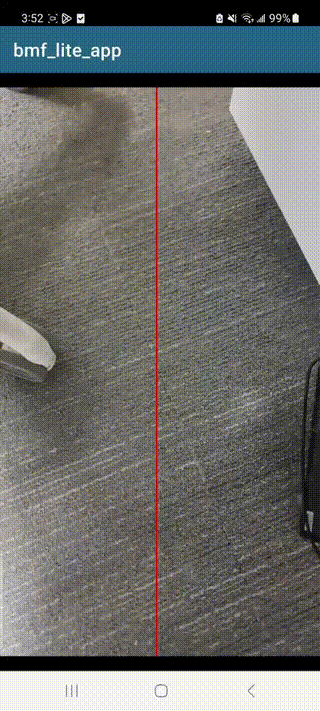

# BMF - Cross-platform, multi-language, customizable video processing framework with strong GPU acceleration

**BMF (Babit Multimedia Framework)** is a cross-platform, multi-language, customizable multimedia processing framework developed by [**ByteDance**](https://www.bytedance.com/en).
With over 4 years of testing and improvements, BMF has been tailored to adeptly tackle challenges in our real-world production environments. It is currently widely used in ByteDance's video streaming, live transcoding, cloud editing and mobile pre/post processing scenarios. More than 2 billion videos are processed by the framework every day.

Here are some key features of BMF:

- **Cross-Platform Support:** Native compatibility with Linux, Windows, and Mac OS, as well as optimization for both x86 and ARM CPUs.

- **Easy to use:** BMF provides Python, Go, and C++ APIs, allowing developers the flexibility to code in their favourite languages.

- **Customizability:** Developers can enhance the framework's features by adding their own modules independently because of BMF decoupled architecture.

- **High performance:** BMF has a powerful scheduler and strong support for heterogeneous acceleration hardware. Moreover, [**NVIDIA**](https://www.nvidia.com/) has been cooperating with us to develop a highly optimized GPU pipeline for video transcoding and AI inference.

- **Efficient data conversion:** BMF offers seamless data format conversions across popular frameworks (FFmpeg/Numpy/PyTorch/OpenCV/TensorRT), conversion between hardware devices (CPU/GPU), and color space and pixel format conversion.

[**BMFLite**](./bmf_lite/README.md) is a client-side cross-platform, lightweight, more efficient client-side multimedia processing framework.
So far, the BMFLite client-side algorithm is used in apps such as Douyin/Xigua, serving more than one billion users in live streaming/video playing/pictures/cloud games and other scenarios, and processing videos and pictures trillions of times every day.

Dive deeper into BMF's capabilities on our [website](https://babitmf.github.io/) for more details.

## Quick Experience
In this section, we will directly showcase the capabilities of the BMF framework around six dimensions: **Transcode**, **Edit**, **Meeting/Broadcaster**, **GPU acceleration**, **AI Inference**, and **client-side Framework**. For all the demos provided below, corresponding implementations and documentation are available on Google Colab, allowing you to experience them intuitively.

### Transcode
This demo describes step-by-step how to use BMF to develop a transcoding program, including video transcoding, audio transcoding, and image transcoding. In it, you can familiarize yourself with how to use BMF and how to use FFmpeg-compatible options to achieve the capabilities you need.

If you want to have a quick experiment, you can try it on 

### Edit
The Edit Demo will show you how to implement a high-complexity audio and video editing pipeline through the BMF framework. We have implemented two Python modules, video_concat and video_overlay, and combined various atomic capabilities to construct a complex BMF Graph.

If you want to have a quick experiment, you can try it on 

### Meeting/Broadcaster
This demo uses BMF framework to construct a simple broadcast service. The service provides an API that enables dynamic video source pulling, video layout control, audio mixing, and ultimately streaming the output to an RTMP server. This demo showcases the modularity of BMF, multi-language development, and the ability to dynamically adjust the pipeline.

Below is a screen recording demonstrating the operation of broadcaster:

### GPU acceleration

#### GPU Video Frame Extraction
The video frame extraction acceleration demo shows:
1. BMF flexible capability of:

   *   Multi-language programming, we can see multi-language modules work together in the demo
   *   Ability to extend easily, there are new C++, Python modules added simply
   *   FFmpeg ability is fully compatible

2. Hardware acceleration quickly enablement and CPU/GPU pipeline support

   *   Heterogeneous pipeline is supported in BMF, such as process between CPU and GPU
   *   Useful hardware color space conversion in BMF

If you want to have a quick experiment, you can try it on 

#### GPU Video Transcoding and Filtering

The GPU transcoding and filter module demo shows:
1. Common video/image filters in BMF accelerated by GPU
2. How to write GPU modules in BMF

The demo builds a transcoding pipeline which fully runs on GPU:

decode->scale->flip->rotate->crop->blur->encode

If you want to have a quick experiment, you can try it on 

### AI inference

#### LLM preprocessing

The [prototype]() of how to build a video preprocessing for LLM training data in Bytedance, which serves billions of clip processing each day.

The input video will be split according to scene change, and subtitles in the video will be detected and cropped by OCR module, and the video quality will be assessed by BMF provided aesthetic module.
After that, the finalized video clips will be encoded as output.

If you want to have a quick experiment, you can try it on 

#### Deoldify

This demo shows how to integrate the state of art AI algorithms into the BMF video processing pipeline. The famous open source colorization algorithm [DeOldify](https://github.com/jantic/DeOldify) is wrapped as a BMF pyhton module in less than 100 lines of codes. The final effect is illustrated below, with the original video on the left side and the colored video on the right. 

If you want to have a quick experiment, you can try it on 

 
#### Super Resolution
This demo implements the super-resolution inference process of [Real-ESRGAN](https://github.com/xinntao/Real-ESRGAN) as a BMF module, showcasing a BMF pipeline that combines decoding, super-resolution inference and encoding.

If you want to have a quick experiment, you can try it on 

#### Video Quality Score

This demo shows how to invoke our aesthetic assessment model using bmf. Our deep learning model Aesmode has achieved a binary classification accuracy of 83.8% on AVA dataset, reaching the level of academic SOTA, and can be directly used to evaluate the aesthetic degree of videos by means of frame extraction processing. 

If you want to have a quick experiment, you can try it on 

#### Face Detect With TensorRT

This Demo shows a full-link face detect pipeline based on TensorRT acceleration, which internally uses the TensorRT-accelerated Onnx model to process the input video. It uses the NMS algorithm to filter repeated candidate boxes to form an output, which can be used to process a Face Detection Task efficiently.

If you want to have a quick experiment, you can try it on 

### Client-side Framework

#### Edge AI models
This case illustrates the procedures of integrating an external algorithm module into the BMFLite framework and management of its execution.

#### Real-time denoise
This example implements the denoise algorithm as a BMF module, showcasing a BMF pipeline that combines video capture, noise reduction and rendering.

## Table of Contents

- [About BMF](https://babitmf.github.io/about/)

- [Quick Experience](#quick-experience)
  - [Transcode](#transcode)
  - [Edit](#edit)
  - [Meeting/Broadcaster](#meetingbroadcaster)
  - [GPU acceleration](#gpu-acceleration)
    - [GPU Video Frame Extraction](#gpu-video-frame-extraction)
    - [GPU Video Transcoding and Filtering](#gpu-video-transcoding-and-filtering)
  - [AI Inference](#ai-inference)
    - [Deoldify](#deoldify)
    - [Super Resolution](#super-resolution)
    - [Video Quality Score](#video-quality-score)
    - [Face Detect With TensorRT](#face-detect-with-tensorrt)

- [Getting Started](https://babitmf.github.io/docs/bmf/getting_started_yourself/)
  - [Install](https://babitmf.github.io/docs/bmf/getting_started_yourself/install/)
  - [Create a Graph](https://babitmf.github.io/docs/bmf/getting_started_yourself/create_a_graph/)
    - one of transcode example with 3 languages
  - [Use Module Directly](https://babitmf.github.io/docs/bmf/getting_started_yourself/use_module_directly/)
    - sync mode with 3 languages. You can try it on:

      Python:
      C++:
      Go:
  - [Create a Module](https://babitmf.github.io/docs/bmf/getting_started_yourself/create_a_module/)
    - customize module with python, C++ and Go. You can try it on 

- [Multiple Features (with examples)](https://babitmf.github.io/docs/bmf/multiple_features/)
  - [Graph Mode](https://babitmf.github.io/docs/bmf/multiple_features/graph_mode/)
    - [Generator Mode](https://babitmf.github.io/docs/bmf/multiple_features/graph_mode/generatemode/)
    - [Sync Mode](https://babitmf.github.io/docs/bmf/multiple_features/graph_mode/syncmode/)
    - [Server Mode](https://babitmf.github.io/docs/bmf/multiple_features/graph_mode/servermode/)
    - [Preload Mode](https://babitmf.github.io/docs/bmf/multiple_features/graph_mode/preloadmode/)
    - [Subgraph](https://babitmf.github.io/docs/bmf/multiple_features/graph_mode/subgraphmode/)
    - [PushData Mode](https://babitmf.github.io/docs/bmf/multiple_features/graph_mode/pushdatamode/)
  - [FFmpeg Fully Compatible](https://babitmf.github.io/docs/bmf/multiple_features/ffmpeg_fully_compatible/)
  - [Data Convert Backend](https://babitmf.github.io/docs/bmf/multiple_features/data_backend/)
  - [Dynamic Graph](https://babitmf.github.io/docs/bmf/multiple_features/dynamic_graph/)
  - [GPU Hardware Acceleration](https://babitmf.github.io/docs/bmf/multiple_features/gpu_hardware_acc/)
  - [BMF Tools](https://babitmf.github.io/docs/bmf/multiple_features/tools/)

- APIs
  - [API in Python](https://babitmf.github.io/docs/bmf/api/api_in_python/)
  - [API in Cpp](https://babitmf.github.io/docs/bmf/api/api_in_cpp/)
  - [API in Go](https://babitmf.github.io/docs/bmf/api/api_in_go/)

- [License](#license)
- [Contributing](#contributing)

## License
The project has an [Apache 2.0 License](https://github.com/BabitMF/bmf/blob/master/LICENSE). Third party components and dependencies remain under their own licenses.

## Contributing

Contributions are welcomed. Please follow the
[guidelines](https://github.com/BabitMF/bmf/blob/master/CONTRIBUTING.md).

We use GitHub issues to track and resolve problems. If you have any questions, please feel free to join the discussion and work with us to find a solution.

## Acknowledgment
The decoder, encoder and filter reference [ffmpeg cmdline tool](http://ffmpeg.org/). They are wrapped as BMF's built-in modules under the LGPL license.

The project also draws inspiration from other popular frameworks, such as [ffmpeg-python](https://github.com/kkroening/ffmpeg-python) and [mediapipe](https://github.com/google/mediapipe). Our [website](https://babitmf.github.io/) is using the project from [docsy](https://github.com/google/docsy) based on [hugo](https://github.com/gohugoio/hugo).

Here, we'd like to express our sincerest thanks to the developers of the above projects!
