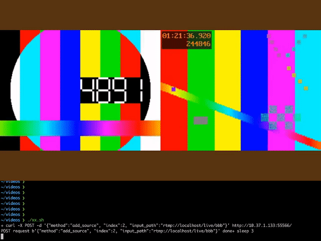

# Babit Multimedia Framework

***BMF(Babit Multimedia Framework, BabitMF)** is a universal multimedia processing framework launched by [**ByteDance**](https://www.bytedance.com/en) that provides a concise and easy-to-use cross-language interface, flexible scheduling and scalability. It dynamically expands, manages and reuses the atomic capabilities of video processing in a modular way, and builds high-performance multimedia processing links in a graph/pipeline manner or implements engineering integration by directly invoking individual processing capabilities*

*Our collaborative contributor includes [**NVIDIA**](https://www.nvidia.com/), and we have our own official website, welcome to browse and put forward your valuable opinions: https://babitmf.github.io/*

## About BMF
BMF helps multimedia users easily and efficiently implement projects in production environments. the cases used BMF cover video transcoding, video frame extraction, video enhancement, video analysis, video interpolation, video editing, video conferencing, VR, and etc. Currently, hundreds of millions of videos are processed using BMF daily. During the implementation of these business scenarios, BMF's functional diversity, ease of use, compatibility, stability and performance have been fully polished.

## Quick Experience
In this section, we will directly showcase the capabilities of the BMF framework around five dimensions: **Transcode**, **Edit**, **Meeting/Broadcaster**, **CPU+GPU acceleration**, and **AI**. For all the demos provided below, corresponding implementations and documentation are available on Google Colab, allowing you to experience them intuitively.

### Transcode
This demo describes step-by-step how to use BMF to develop a transcoding program, including video transcoding, audio transcoding, and image transcoding. In it, you can familiarize yourself with how to use BMF and how to use FFmpeg-compatible options to achieve the capabilities you need.

If you want to have a quick experiment, you can try it on 

### Edit
The Edit Demo will show you how to implement a high-complexity audio and video editing pipeline through the BMF framework. We have implemented two Python modules, video_concat and video_overlay, and combined various atomic capabilities to construct a complex BMF Graph.

If you want to have a quick experiment, you can try it on 

### Meeting/Broadcaster
This demo uses BMF framework to construct a simple broadcast service. The service provides an API that enables dynamic video source pulling, video layout control, audio mixing, and ultimately streaming the output to an RTMP server. This demo showcases the modularity of BMF, multi-language development, and the ability of dynamically adjusting the pipeline.

operation broadcaster:

### CPU+GPU acceleration

#### Video Frame Extraction
The video frame extraction acceleration demo shows:
1. BMF flexible capability of:

   *   Multi-language programming，we can see multi-language module work together in the demo
   *   Ability extend easily, there are new C++, Python modules added simply
   *   FFmpeg ability fully compatible

2. Hardware acceleration quickly enablement and CPU/GPU pipeline support

   *   Heterogeneous pipeline is supported in BMF, such as process between CPU and GPU
   *   Usefull hardware color space convertion in BMF

If you want to have a quick experiment, you can try it on 

#### GPU Video Processing

The GPU transcoding and filter module demo shows:
1. Common video/image filters in BMF accelerated by GPU
2. How to write GPU modules in BMF

The demo builds a transcoding pipeline which fully runs on GPU:

decode->scale->flip->rotate->crop->blur->encode

If you want to have a quick experiment, you can try it on 

### AI

#### Deoldify

This demo shows the how to integrate the state of art AI algorithms into the BMF video processing pipeline. The famous open source colorization algorithm [DeOldify](https://github.com/jantic/DeOldify) is wrapped as an BMF pyhton module in less than 100 lines of codes. The final effect is illustrated below, with the original video on the left side and the colored video on the right. 

If you wan't to have a quick experiment, you can try it on 

 
#### Supper Resolution
This demo implements the super-resolution inference process of [Real-ESRGAN](https://github.com/xinntao/Real-ESRGAN) as a BMF module, showcasing a BMF pipeline that combines decoding, super-resolution inference and encoding.

If you wan't to have a quick experiment, you can try it on 

#### Video Quality Score

This demo shows how to invoke our aesthetic assessment model using bmf. Our deep learning model Aesmode has achieved a binary classification accuracy of 83.8% on AVA dataset, reaching the level of academic SOTA, and can be directly used to evaluate the aesthetic degree of videos by means of frame extraction processing. 

If you wan't to have a quick experiment, you can try it on 

## Table of Contents

- [About BMF](https://babitmf.github.io/about/)

- [Quick Experience](#quick-experience)
  - [Transcode](#transcode)
  - [Edit](#edit)
  - [Meeting/Broadcaster](#meetingbroadcaster)
  - [CPU+GPU acceleration](#cpugpu-acceleration)
    - [Video Frame Extraction](#video-frame-extraction)
    - [GPU Video Processing](#gpu-video-processing)
  - [AI](#ai)
    - [Deoldify](#deoldify)
    - [Supper Resolution](#supper-resolution)
    - [Video Quality Score](#video-quality-score)

- [Getting Started Yourself](https://babitmf.github.io/docs/bmf/getting_started_yourself/)
  - [Install](https://babitmf.github.io/docs/bmf/getting_started_yourself/install/)
  - [Create a Graph](https://babitmf.github.io/docs/bmf/getting_started_yourself/create_a_graph/)
    - one of transcode example with 3 languages
  - [Use Module Directly](https://babitmf.github.io/docs/bmf/getting_started_yourself/use_module_directly/)
    - sync mode with 3 languages. You can try it on:

      Python:
      C++:
      Go:
  - [Create a Module](https://babitmf.github.io/docs/bmf/getting_started_yourself/create_a_module/)
    - customize module with python, C++ and Go. You can try it on 

- [Multiple Features (with examples)](https://babitmf.github.io/docs/bmf/multiple_features/)
  - [Graph Mode](https://babitmf.github.io/docs/bmf/multiple_features/graph_mode/)
    - [Generator Mode](https://babitmf.github.io/docs/bmf/multiple_features/graph_mode/generatemode/)
    - [Sync Mode](https://babitmf.github.io/docs/bmf/multiple_features/graph_mode/syncmode/)
    - [Server Mode](https://babitmf.github.io/docs/bmf/multiple_features/graph_mode/servermode/)
    - [Preload Mode](https://babitmf.github.io/docs/bmf/multiple_features/graph_mode/preloadmode/)
    - [Subgraph](https://babitmf.github.io/docs/bmf/multiple_features/graph_mode/subgraphmode/)
    - [PushData Mode](https://babitmf.github.io/docs/bmf/multiple_features/graph_mode/pushdatamode/)
  - [FFmpeg Fully Compatible](https://babitmf.github.io/docs/bmf/multiple_features/ffmpeg_fully_compatible/)
  - [Data Convert Backend](https://babitmf.github.io/docs/bmf/multiple_features/data_backend/)
  - [Dynamic Graph](https://babitmf.github.io/docs/bmf/multiple_features/dynamic_graph/)
  - [GPU Hardware Acceleration](https://babitmf.github.io/docs/bmf/multiple_features/gpu_hardware_acc/)
  - [BMF Tools](https://babitmf.github.io/docs/bmf/multiple_features/tools/)

- [API in Python](https://babitmf.github.io/docs/bmf/api/api_in_python/)
- [API in Cpp](https://babitmf.github.io/docs/bmf/api/api_in_cpp/)
- [API in Go](https://babitmf.github.io/docs/bmf/api/api_in_go/)
- [License](#license)
- [Contributing](#contributing)

## License
This project is licensed under the Apache License 2.0 - see the [LICENSE](https://github.com/BabitMF/bmf/blob/master/LICENSE) file for details.

## Contributing

We welcome contributions. Please follow these
[guidelines](https://github.com/BabitMF/bmf/blob/master/CONTRIBUTING.md).

We use GitHub issues to track and resolve bugs. If you have any questions, please feel free to join the discussion and work with us to find a solution.

