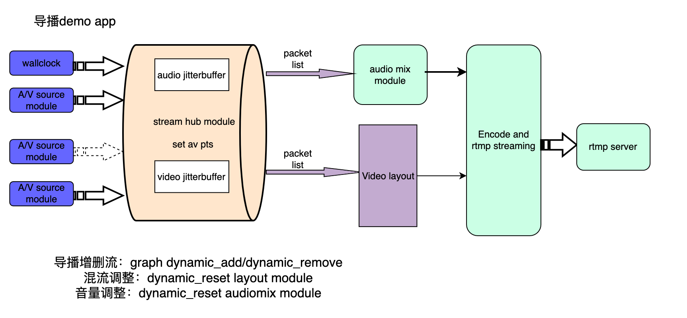

# broadcaster demo

[中文文档](./readme_cn.md)

This demo uses BMF framework to construct a simple broadcast service. The service provides an API that enables dynamic video source pulling, video layout control, audio mixing, and ultimately streaming the output to an RTMP server. This demo showcases the modularity of BMF, multi-language development, and the ability of dynamically adjusting the pipeline.


## The graph of the broadcaster demo



- wall clock module
     Wallclock is used to generate audio and video timestamps. For example, if the broadcaster demo is configured to 25 fps, 44100 dual-channel lc-aac output, wallclock generates the timestamp of each frame of audio and video, and sends it to the streamhub module as the background audio and video timestamp input. At the same time, it serves as a stable source to drive the entire graph, so that the broadcaster app can continuously output streams.

- c_ffmpeg_decoder module

     The input source of the demo, which can generate audio and video streams. This demo uses the built-in c_ffmpeg_decoder module of bmf. The demo supports rtmp input stream, and the audio is 44100 dual-channel lc-aac source. This module connects to the streamhub module.
    
- streamhub module

     Each input stream is equipped with a jitter buffer to enable smooth and uniform output. In order to mix multiple streams and display them on the same screen, it is necessary to align the timestamps and frame rates. Streamhub module binds all input stream frames together based on the background audio and video timestamps, and outputs them as a whole to the audiomix and videolayout module.

- audiomix module

     The audiomix module can configure the audio output parameters during initialization. It mixes the framelist output by streamhub, and only supports audio input with 1024 samples, dual channel and a sampling rate of 44100.

- videolayout module

     The videolayout module blends the framelist output by streamhub and can be configured with various parameters to control the display coordinates of multiple streams. 

- c_ffmpeg_encoder module

     As a broadcaster output module, it interfaces with videolayout and audiomix, encodes and outputs rtmp streams.


## Steps needed to run the demo

1. An RTMP server that supports both pushing and pulling streams, used for broadcasting output. 
2. Install the bmf python package
3. python3 broadcaster.py

## Control the broadcaster app through http api

Each source has a unique `index` used to identify its id, and the control api uses this `index` to indicate which source is controlled.

- Add material source

     ```
     curl -X POST -d '{"method":"add_source", "index":0, "input_path":"rtmp://localhost/live/zx"}' http://localhost:55566/
     ```


- delete footage source

     ```
     curl -X POST -d '{"method":"remove_source", "index":0}' http://localhost:55566/
     ```


- Change video layout

     ```
     curl -X POST -d '{"method":"set_layout", "layout":{"background_color":"#958341"}}' http://localhost:55566/

     curl -X POST -d '{"method":"set_layout", "layout":{"layout_mode":"speaker"}}' http://localhost:55566/

     curl -X POST -d '{"method":"set_layout", "layout":{"layout_mode":"gallery"}}' http://localhost:55566/
     ```

- Set source audio volume

     The volume range is [0,10]

     ```
     curl -X POST -d '{"method":"set_volume", "index":0, "volume":1.5}' http://localhost:55566/
     ```


