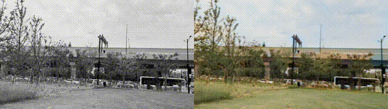

# About this demo

Colorization algorithms have a wide range of applications in various fields, such as historical photo restoration and artistic rendering. 

This demo shows the how to integrate the state of art AI algorithms into the BMF video processing pipeline. The famous open source colorization algorithm [DeOldify](https://github.com/jantic/DeOldify) is wrapped as an BMF pyhton module in less than 100 lines of codes. The final effect is illustrated below, with the original video on the left side and the colored video on the right.


The steps listed in this markdown file is used to run the code on your own machine. If you wan't to have a quick experiment, you can try it on [](https://colab.research.google.com/github/BabitMF/bmf/blob/master/bmf/demo/colorization_python/deoldify_demo_colab.ipynb).


# Acknowledgement
The algorithm used in the demo is forked from the github project [DeOldify](https://github.com/jantic/DeOldify). We want to express our sincere appreciation and gratitude to the authors for this exceptional open-source project.

# Get Started

## 1. Environment Setup

*   install the environment for the deoldify algorithm
*   install the BMF

### 1.0 install conda
If you're using this demo on own machine or in a docker, it's better that you create an isolated virtual environment first. 

```Bash
conda create -n deoldify_py39 python=3.9
conda activate deoldify_py39
```

### 1.1 git clone the deoldify project. 
The project is forked from the original github project. We add some suppport for Pillow Image input.

```Bash
git clone https://github.com/eefengwei/DeOldify.git DeOldify
```

### 1.2 install the dependent python packages
```Bash
pip3 install -r ./DeOldify/requirements-colab.txt
```

### 1.3 download the pretrained-weights
```Bash
mkdir -p ./DeOldify/models
wget -c https://huggingface.co/spensercai/DeOldify/resolve/main/ColorizeVideo_gen.pth -O ./DeOldify/models/ColorizeVideo_gen.pth
```

### 1.4 pip install BMF packages
```Bash
pip3 install bmf
```
### 1.5 verify the FFmpeg libraries is installed and version is correct

BMF framework utilizes the FFmpeg video decoders and encoders as the built-in modules for video decoding and encoding. **It's neccessary for users to install supported FFmpeg libraries before using BMF.** 

```Bash
sudo apt install ffmpeg
```

List the ffmpeg libraries. It is expected that the related libraries such libavcodec, libavformat are installed. 

```Bash
dpkg -l | grep -i ffmpeg
```

Display the FFmpeg version. **BMF supports the FFmpeg verions above 4.2.x.**
```Bash
ffmpeg -version
```

## 2. BMF processing pipeline programming
*   implement the customized BMF python module, which is the DeOldify video colorization algorithm.
*   set up the BMF processing pipeline (decoding->colorizaiton->encoding) and run it. 

```Python
import sys
sys.path.insert(0, '/content/DeOldify')
print(sys.path)
```

### 2.1 Customized BMF module

Implement the customized BMF python module, which is the DeOldify video colorization algorithm. The python implementation code is in [py_deoldify_module.py](./py_deoldify_module.py).


### 2.2 BMF pipeline setup

input_video_path is the input video path, and output_video_path is the output colored video path. model_weight_path is the path where you download the model weights in step 1.3. 

The python implementation code is in [deoldify_demo.py](./deoldify_demo.py).

### 2.3 run the pipeline
```Bash
python3 deoldify_demo.py
```

When the program successfully finished, you will have the colorized output video. 


