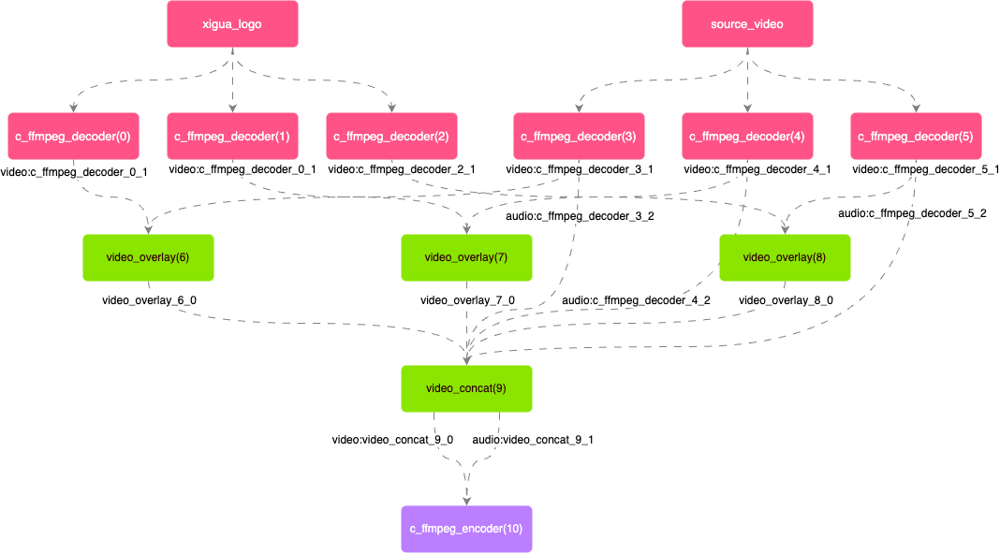

# About Edit Demo
This notebook will show you a demo of video editing implemented through the BMF framework: through the Module that realizes two features used subgraph, it provides the overlay and concat capabilities of multiple audio and video channels, and completes a complex video editing pipeline.

The steps listed in this markdown file is used to run the code on your own machine. If you wan't to have a quick experiment, you can try it on .

This demo implements two modules used subgraph (video_concat and video_overlay). In the process of pipeline, it first creates three video streams, overlays them with the logo of Xigua Video respectively, then sends the three processed video streams and corresponding audio streams to video_concat module, a complex audio and video editing Demo is implemented, in which the topology of the bmf graph can be represented by the following figure:

