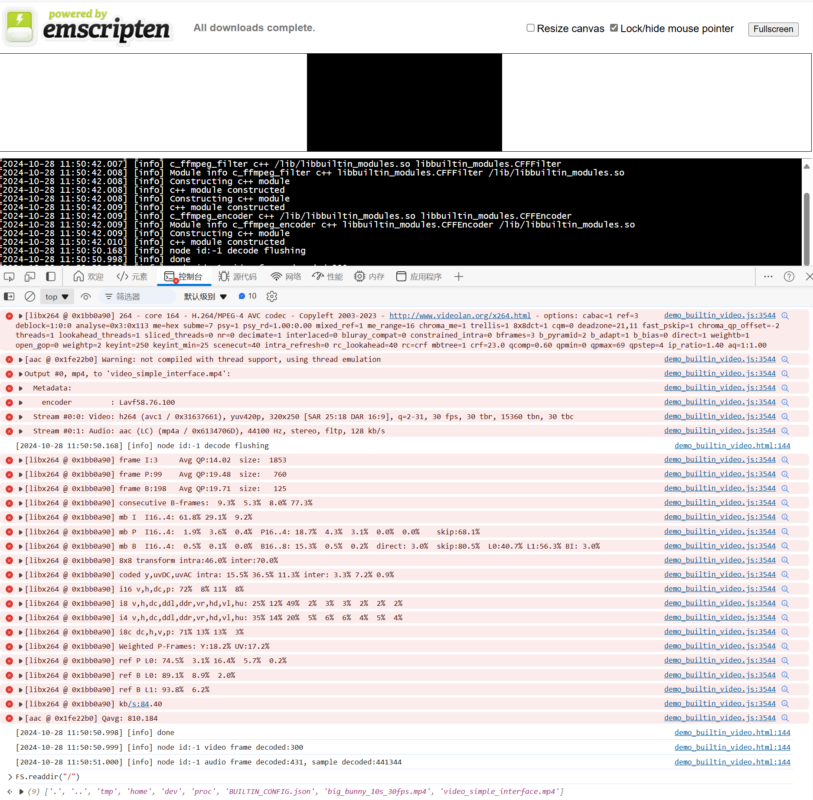
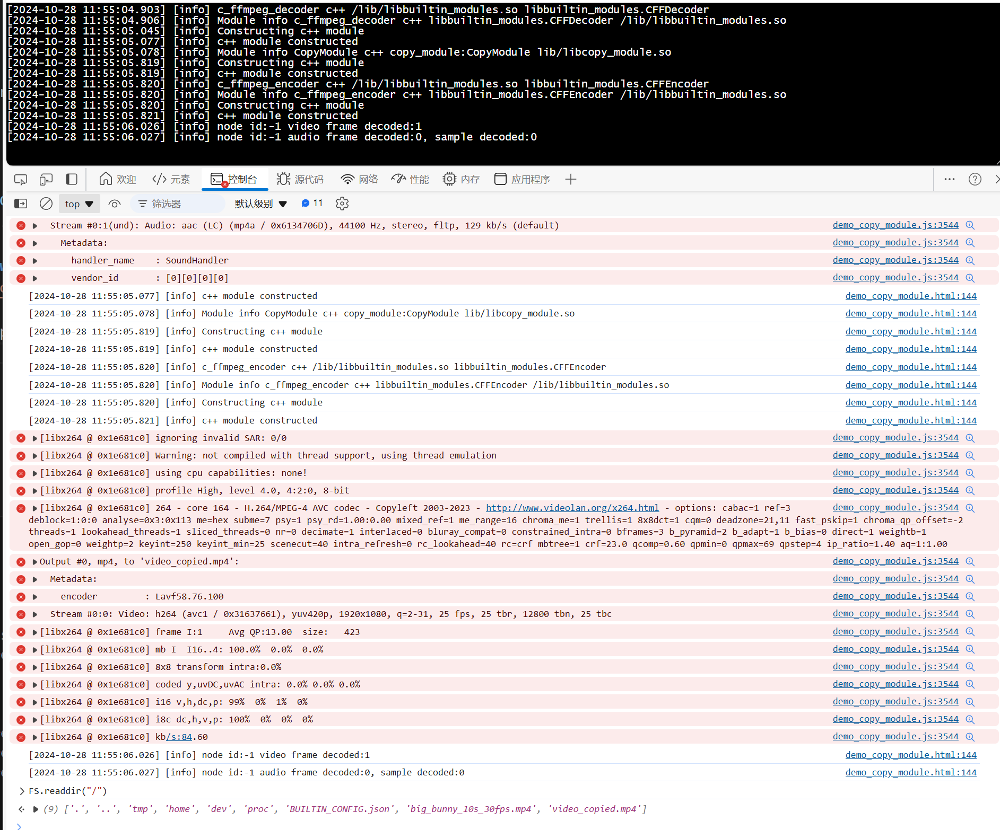

# Introduction
This demo includes two programs:

* The first program decodes, transforms, and encodes video using built-in modules.
* The second program decodes video, utilizes an external copy module, and encodes the video.

All modules operate in synchronous mode, as multithreading is not yet supported.


# Prerequisite
1. Build your FFmpeg and x264 encoder using Emscripten.
2. Download the assets from [here](https://github.com/BabitMF/bmf/releases/download/files/files.tar.gz) and copy big_bunny_10s_30fps.mp4 to the base path of your BMF project.
3. Set up an HTTP server to host the WebAssembly resources.
4. Create a lib folder in the directory where the demo_*.html files are generated, and copy libbuiltin_modules.so into it. (Typically, this file can be found in `$PATH_TO_YOUR_BMF/build/output/bmf/bin`. You can also use the command `find . -name "demo_copy_module.html"` to locate it.)
## Example of a python webserver
### Find the directory
```bash
PATH_TO_YOUR_PROJECT=...
SERVER_DIRECTORY=$(realpath "$(dirname "$(find $PATH_TO_YOUR_PROJECT -name "demo_copy_module.html")")")
LIB_DIRCTORY=$(realpath $(dirname $(find $PATH_TO_YOUR_PROJECT/build/output/bmf/lib -name "libbuiltin_modules.so")))
```

### Generate HTTPS Public and Private Key
```bash
openssl req -newkey rsa:2048 -x509 -keyout server.pem -out server.pem -days 365 -nodes
```

### Set Up a HTTPS Server
Create a Python script with the following code:
(You can use the script at same directory as well)
```python
import http.server
import ssl
directory=$SERVER_DIRECTORY # EDIT IT ON YOUR OWN

class CustomHTTPRequestHandler(http.server.SimpleHTTPRequestHandler):
    def __init__(self, *args, **kwargs):
        super().__init__(*args, directory=directory, **kwargs)
    def end_headers(self):
        self.send_header('Cross-Origin-Opener-Policy', 'same-origin')
        self.send_header('Cross-Origin-Embedder-Policy', 'require-corp')
        super().end_headers()

server_address = ('0.0.0.0', 443)
httpd = http.server.HTTPServer(server_address, CustomHTTPRequestHandler)
httpd.socket = ssl.wrap_socket(httpd.socket,
                               keyfile="server.pem",  
                               certfile="server.pem",# Create you own
                               server_side=True)

print(f"Serving on port {server_address[1]}")
httpd.serve_forever()
```

### Copy modules
```bash
mkdir $SERVER_DIRECTORY/lib
cp $LIB_DIRCTORY/*.so $SERVER_DIRECTORY/lib
```
# Run tests in browser
Visit `https://demo_builtin_video.html` and `https://demo_copy_module.html`.

Utilize the developer tools to view additional logs and download resources from the filesystem.

## Screenshoot






