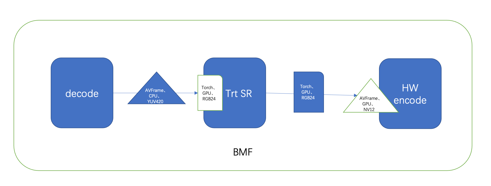

## BMF Data Convert Backend
Currently, the backend interface is under testing.

### Background
An all-in-one solution is needed when multiple dimontion factors involved in video process pipeline such as CPU/GPU devices, YUV420/NV12 or RGB24/RGB48, and AVFrame or Torch structure.
As a framework, each of module just focus on it's own target and data requirement, but it becomes complex when multiple modules work together as below supper resolution pipeline:


We can see that different modules have their own data requirement, the decode module output FFmpeg AVFrame with YUV420 pixel format which located on CPU memory, while the Trt SR module requires input data to be torch with RGB24 which located on GPU memory, after hardware accelerated SR by the Trt module, the output data need to be encoded by GPU, so the HW encode module can get AVFrame with NV12 pixel format which located on GPU memory to encode it by GPU.

It tends to include the capabilities of video data convertion below:
- pixel format and color space
- devices between CPU and GPU
- different media types such as avframe, cvmat and torch

### C++ Interface

```
/** @addtogroup bmf_backend_convert
 * @{
 * @arg src_vf: src VideoFrame
 * @arg src_dp: src MediaDesc that describe src_vf's attributes
 * @arg dst_dp: The desired MediaDesc of the converted VideoFrame.
 * @} */
BMF_API VideoFrame bmf_convert(VideoFrame& src_vf, const MediaDesc &src_dp, const MediaDesc &dst_dp);
```

This interface allows the conversion of a source VideoFrame to a destination VideoFrame. If the media_type in the source MediaDesc is different from the media_type in the destination MediaDesc, it indicates that the conversion will involve the transformation between VideoFrame and a third-party data structure. Accessing the third-party data structure requires the use of the private_attach and private_get methods of the VideoFrame. 

#### VideoFrame scale and colorspace conversion

use `bmf_convert` do scale and csc

```
    MediaDesc dp;
    dp.width(1920).pixel_format(hmp::PF_YUV420P);
    auto rgbformat = hmp::PixelInfo(hmp::PF_RGB24);
    auto src_vf = VideoFrame::make(640, 320, rgbformat);
    auto dst_vf = bmf_convert(src_vf, MediaDesc{},  dp);
    EXPECT_EQ(dst_vf.width(), 1920);
    EXPECT_EQ(dst_vf.height(), 960);
    EXPECT_EQ(dst_vf.frame().format(), hmp::PF_YUV420P);

```

#### Conversion between VideoFrame and third-party data structure

bmf support the following types of third-party structures conversion with VideoFrame

1. FFmpeg AVFrame
2. Opencv cv::Mat
3. libtorch at::Tensor

Here, FFmpeg AVFrame is used as an example to illustrate the conversion. Other types of conversions can be referred to in the `test_convert_backend.cpp`.

##### VideoFrame to ffmpeg AVFrame

1. include <bmf/sdk/av_convertor.h>, this will register AVConvertor for AVFrame
2. dst_dp set media_type with value MediaType::kAVFrame
3. do `bmf_convert`, check the return VideoFrame is a valid VideoFrame
4. use `private_get<AVFrame>` get the AVFrame pointer from the return VideoFrame.

It is important to note that the lifecycle of the structure pointed to by the pointer obtained from private_get is managed by the VideoFrame to which it belongs.

some example code snippet：

```
#include <bmf/sdk/av_convertor.h>

    MediaDesc dp;
    dp.width(1920).height(1080).pixel_format(hmp::PF_RGB24).media_type(MediaType::kAVFrame);
    auto yuvformat = hmp::PixelInfo(hmp::PF_YUV420P);
    auto src_vf = VideoFrame::make(640, 320, yuvformat);

    auto dst_vf = bmf_convert(src_vf, MediaDesc{}, dp);
    EXPECT_TRUE(static_cast<bool>(dst_vf));

    const AVFrame* frame = dst_vf.private_get<AVFrame>();
    EXPECT_EQ(frame->width, 1920);
    EXPECT_EQ(frame->height, 1080);
    EXPECT_EQ(frame->format, AV_PIX_FMT_RGB24);

```

#### AVFrame to VideoFrame

1. use `private_attach` set AVFrame as private_data of VideoFrame
2. src_dp set media_type with value MeidaType::kAVFrame
2. use `bmf_convert` do converting
3. get the return VideoFrame

some example code snippet：

```
    VideoFrame src_with_avf;
    src_with_avf.private_attach<AVFrame>(frame);
    MediaDesc src_dp;
    src_dp.pixel_format(hmp::PF_RGB24).media_type(MediaType::kAVFrame);
    VideoFrame vf = bmf_convert(src_with_avf, src_dp, MediaDesc{});

```


### Python Interface
