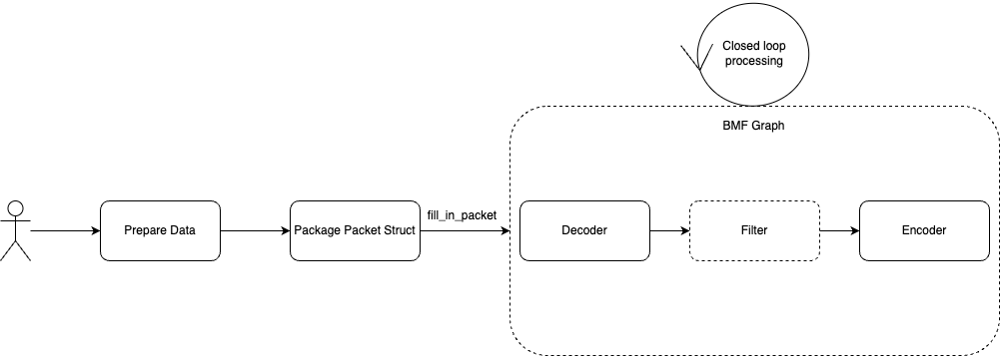

## Push_Data Mode

The push data mode is also an important capability of BMF Graph. As the figure shown below, Generate Mode provides the ability to extract the processing result Frames of graph, and Push Mode provides the ability to "feed" the input of the graph.



Users only need to pay attention to the node connection and operation logic of Graph, and keep filling packets to Graph.

The suitable scenario for this mode is: the user's input source comes from other third-party libraries or some custom data types, and needs to do many custom processing operations on the input that have nothing to do with the BMF framework.

Let's show an example of using push data mode:

```
@timeout_decorator.timeout(seconds=120)
def test_push_pkt_into_decoder(self):
    output_path = "./aac.mp4"

    self.remove_result_data(output_path)
    
    graph = bmf.graph({"dump_graph": 1})

    video_stream = graph.input_stream("outside_raw_video")
    decode_stream = video_stream.decode()
    bmf.encode(None,decode_stream["audio"],{"output_path": output_path})
    
    graph.run_wo_block(mode = GraphMode.PUSHDATA)
    pts_ = 0
    for index in range(100,105):
        file_name = "../files/aac_slice/"+str(index)+".aac"
        with open(file_name, "rb") as fp:
            lines = fp.read()    
            buf = BMFAVPacket(len(lines))
            buf.data.numpy()[:] = np.frombuffer(lines, dtype=np.uint8)
            buf.pts = pts_

            packet = Packet(buf)
            pts_ += 1
            packet.timestamp = pts_
            start_time = time.time()
            graph.fill_packet(video_stream.get_name(), packet, True)
    graph.fill_packet(video_stream.get_name(),Packet.generate_eof_packet())
    graph.close()

```

This example reads 5 fltp aac audio streams sequentially, uses push data mode to push them sequentially into the graph, and encodes them into aac.mp4 files.

Let's look at another more complex video processing example:

```
def test_push_raw_stream_into_decoder(self):
    input_video_content = "../files/video_content.txt"
    input_content_size = "../files/video_length.txt"
    output_path = "./push_pkt_output.mp4"

    self.remove_result_data(output_path)

    graph = bmf.graph({"dump_graph": 1})

    video_stream = graph.input_stream("outside_raw_video")
    
    decode_stream = video_stream.module(
        'ffmpeg_decoder', 
        option={
            "video_codec": "h264", 'video_time_base': "1,30000",
            "push_raw_stream": 1
        }
    )

    encode_stream = decode_stream['video'].encode(
        None,
        {
            "output_path": output_path,
            "video_params": {
                "codec": "h264",
                "width": 640,
                "height": 480,
                "max_fr": 30,
                "crf": "23",
                "preset": "veryfast"
            }
        }
    )
    graph.run_wo_block(mode = GraphMode.PUSHDATA)

    f_cont = open(input_video_content,'rb')
    f_size = open(input_content_size,'r')

    pts_ = 0
    timestamp = 0
    lines = f_size.readlines()
    for size in lines:
        pkt = BMFAVPacket(int(size))
        memview = pkt.data.numpy()
        memview[:] = np.frombuffer(f_cont.read(int(size)), dtype='uint8')
        pkt.pts = pts_
        packet = Packet(pkt)
        packet.timestamp = timestamp
        pts_ += 1001
        timestamp += 1
        graph.fill_packet(video_stream.get_name(), packet)

    graph.fill_packet(video_stream.get_name(), Packet.generate_eof_packet())
    graph.close()
    f_size.close()
    f_cont.close()

```

This example implements a processing pipeline that decodes a raw 264 stream in push data mode and re-encodes it inside the graph, which implements a processing pipeline that decodes a raw 264 stream in push data mode and encodes it again inside the graph. In the code, we first build a graph, and then read the raw stream, where video_content.txt stores the binary content of the code stream, video_length, txt stores the size of each packet in turn, and in the option of the graph, we open push_raw_stream switch, which will let the decoder perceive that the packets you will fill in are in raw stream format