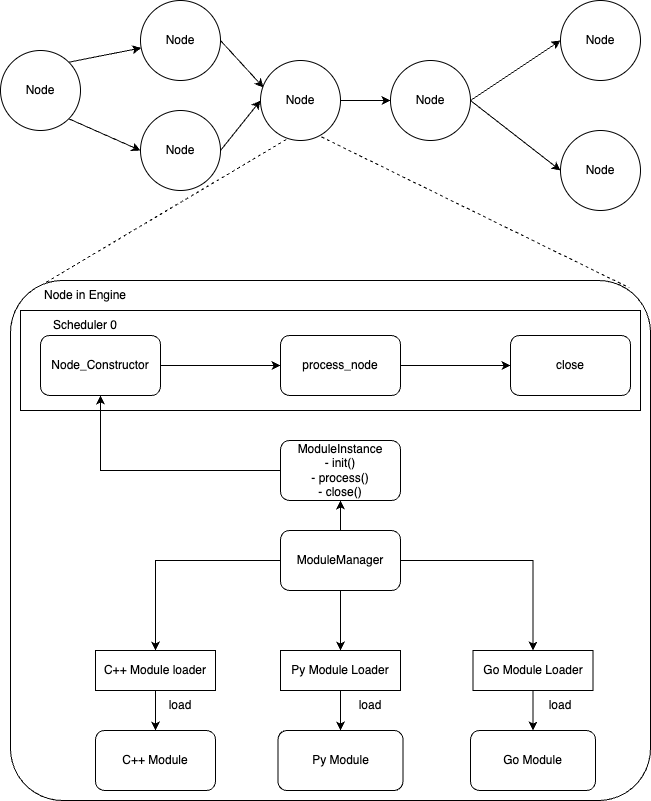

# About Customize Demo
Module is the core function of the BMF framework, which is the essential instance for executing logic. Users first create a BMG Graph and combine the logic of multiple Modules through serial connection to generate a description graph of the audio and video processing pipeline. When the user executes graph.Run() or graph.start(), the graph description produced by the user will be mapped as a real "executing graph" at the Engine layer. This graph is the real instance for executing the Module processing logic, which is composed of multiple Nodes combined in series, and each Node is bound to a Module instance at the bottom.

The Scheduler in the BMF Engine framework is responsible for scheduling each Node. When constructing a Module instance, the program first reads the metadata of the Module, which defines the type, path, entry, and other information of the Module. After obtaining this information, the program uses a singleton, ModuleManager, to construct the Module instance in reality (by loading it using the corresponding language's loader) and provide it to the Node for use.

For a Module, there are three methods to be implemented mustly: init(), process(), and close(). When the Node is scheduled by the Scheduler, these methods will be executed in turn until the lifecycle ends. The architecture described above can be represented by the following diagram:

The steps listed in this markdown file is used to run the code on your own machine. If you wan't to have a quick experiment, you can try it on .

This notebook will show you how to develop Customize Python/C++ Module through the BMF framework as a module developer.Here are the codes with detailed comments:

## 1. Install BMF in Python environment.

## 2. The Engine layer of the BMF framework is uniformly implemented in C++ language. In Colab, when python calls the C++ library, the log of the C++ library layer will be hidden, so it is necessary to install and load the wurlitezer library to enable logs in the C++ layer.

## 3. Download a sample transcoded video (using Big Bunny as an example here).

## 4. Write and implement Customize Module Demo
### Overall, Customize Module Demo can be decomposed into three sub-processes:
### 1. Implement the Customize Module used Python.
### 2. Implement the Customize Module used C++.
### 3. Implement the Customize Module used Go.
We will analyze in detail the above two processes one by one.

### Implement the Customize Module used Python
The following code implements a simple Python module, named my_module. In the process method of my_module, it only does one thing: get a packet from the InputQueue, and then push it into the OutputQueue. Essentially, this is a pass-through module.

Let's implement a BMF Graph in which we use the module interface to call the my_module we just completed. We set the entry as \_\_main\_\_.my_module because all Python code runs in \_\_main\_\_ in Google Colab.

### Implement the Customize Module used C++
The following code implements a simple C++ module, named copy_module. Unlike the above Python module, copy_module will make a copy of the Input Packet and then push it to the OutputQueue. Compared with my_module, copy_module will do one more copy.

To implement a C++ Module, there are several additional steps that need to be taken. First, download and install the BMF Library. Then, implement the module and CMake File separately to complete the construction of the C++ Module. Finally, a compiled product (.so) will be produced.

### Implement the Customize Module used go
The following code implements a simple go module, named pass_through. like c++, pass_through will make a copy of the Input Packet and then push it to the OutputQueue. Compared with my_module, copy_module will do one more copy.

To implement a go Module, there are several additional steps that need to be taken. First, download and install the BMF Library. Then, implement the module and a compiled product (.so) will be produced.

## 5. Display the video streams before and after processing.

