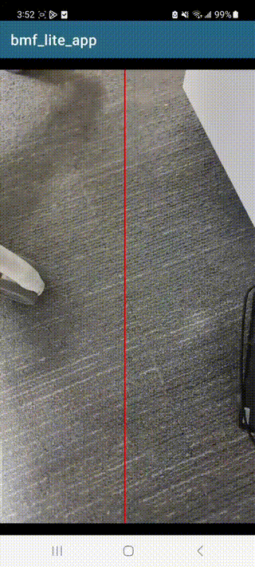

# 1. Building Android Libraries And Running

### Preliminaries

a. Install cmake 3.22.1 in Android Studio SDK Manager.

> Check cmake version with `cmake -version` and make sure cmake version is not less than 3.20.4.

b. Install build tools with

> Install the NDK and jdk.
> The NDK version is greater than or equal to r23.
> The JDK version is greater than or equal to 11.

c. Steps to install QNN SDK

> Register Qualcomm ID: https://myaccount.qualcomm.com/login.

> Download Qualcomm Package Manager: https://qpm.qualcomm.com/#/main/tools/details/QPM3.

> Use Qualcomm Package Manager to extract Quaclomm QNN SDK: https://qpm.qualcomm.com/#/main/tools/details/qualcomm_neural_processing_sdk.

####

    1. qpm-cli --login <username>
    2. qpm-cli --license-activate qualcomm_neural_processing_sdk
    3. qpm-cli --extract qualcomm_neural_processing_sdk
    4. Get header files from include/QNN, copy include/QNN to bmf_lite/src/algorithm/contrib_modules/QnnControlNet/QNN
    5. Get libQnnSystem.so libQnnHtp.so libQnnHtpV75Stub.so from lib/aarch64-android, copy them to bmf_lite/android/app/SRC/main/assets folder
    6. Get libQnnHtpV75Skel.so from lib/hexagon-v75/unsigned, copy them to bmf_lite/android/app/SRC/main/assets folder

> Download QNN ControlNet Models: https://aihub.qualcomm.com/models/controlnet_quantized.

> Rename the 4 downloaded model files, i.e. unet.serialized.bin, text_encoder.serialized.bin, vae_decoder.serialized.bin, controlnet.serialized. bin, copy them to the mobile phone's /data/local/TMP/ControlNetData folder.

> Copy the downloaded configuration file(vocab.txt and merges.txt) to the mobile phone /data/local/tmp/ControlNetData folder.

### Install

#### Build modules only

> ./build_android.sh
> Cpp library output path: bmf_lite/build_android/lib.
> Cpp-test-program output path: bmf_lite/build_android/bin.
> Download [bmf_lite_files.tar.gz](https://github.com/BabitMF/bmf/releases/download/files/bmf_lite_files.tar.gz), extract test.jpg and test-canny.png to demo/test_data.
> Cpp-test-program need android device.
> If you need to run the vincennes chart sample through the cpp test program, you need the 8gen3 chip. In addition, you need to add the dependent resource path and the model library path in the cpp test program (similar to the method in the app code).
> Run-cpp-test-program: bash ci/test_android.sh xxx-device.

#### Build bmf_lite release aar only

> cd android
> ./gradlew :lite:assembleRelease
> Arr library output path: bmf_lite/android/lite/build/outputs/arr.

### Run Android App

> Open the Android folder using Android studio.
> Download [bmf_lite_files.tar.gz](https://github.com/BabitMF/bmf/releases/download/files/bmf_lite_files.tar.gz), extract test.mp4 to bmf_lite/android/app/SRC/main/assets.
> Copy test-canny.png extracted above to the device album.
> Execute the android studio Run button.

### App introduction

Android has prepared three demo examples to demonstrate our Android Bmf framework, including super-resolution, denoising and Vincenzo graphics. Through these examples, we show how to engineering media algorithms into bmf-lite dynamic library, involving GPU processing, rendering, playback and other modules. After running the app, you can see three buttons corresponding to hyperscore, noise reduction and Venison chart. Click in to see the respective effects.

> #### Super Resolution


> #### Denoise



> #### Vincent diagram


# 2. Building iOS Libraries And Running

### Preliminaries

1. Install XCode And CMake

```
brew install cmake
```

> Check cmake version with `cmake -version` and make sure cmake version is not less than 3.20.4.

### Build bmf_lite static library

```
bash build_ios.sh
```

### Run iOS app

Open the bmf_demo.xcodeproj Using XCode, which in folder iOS/bmf_demo.

#### Known Issues

We have prepared four demonstration examples to showcase our framework's capabilities, including super-resolution, denoising, Canny, and Stable diffusion model. Specifically, super-resolution, denoising, and Canny showcase the integration of algorithmic modules into the bmflite dynamic library, while diffusers illustrates how to leverage the framework's capabilities to integrate and manage modules without modifying the bmflite framework.To execute diffusers, it is necessary to have iOS certificates that support 'Extended Virtual Addressing' and 'Increased Memory Limit'. If you run other cases, you can remove these capability.

> #### Super Resolution
>
> In this example, we have implemented a super resolution algorithm as a BMF module, showcasing a BMF pipeline that combines decoding, super resolution and rendering.
> Download [bmf_lite_files.tar.gz](https://github.com/BabitMF/bmf/releases/download/files/bmf_lite_files.tar.gz), extract test.mp4 and put it into XCode to view the effect.


> #### Denoise
>
> This example implements the denoise algorithm as a BMF module, showcasing a BMF pipeline that combines video capture, noise reduction and rendering.


> #### Real Time Canny
>
> In this simple demonstration example, we demonstrate the implementation of a Canny algorithm module using Apple MPS, showcasing a BMF pipeline that combines video capture, canny and rendering.


> #### CoreML Diffusers
>
> This case illustrates the process of integrating an external algorithm module into the bmf_lite framework and managing its execution. To execute this case, it is necessary to have iOS certificates that support 'Extended Virtual Addressing' and 'Increased Memory Limit'. This model demands high performance, requiring the iOS system version to be 17 or above, running on the Neural Engine and CPU, and consuming significant memory.

- Kill the app when you are not using.
- Disconnect from XCode during runtime.
- Reboot your device.
- Avoid testing multiple times in a short period of time.


# 3. Building OHOS Libraries and running the sample

### Preliminaries

Before you start, make sure to get the following requirements ready.

1. Register on Huawei developer platform to become a developer.
   https://developer.huawei.com/consumer/en/doc/start/registration-and-verification-0000001053628148

2. Download and install DevEco-Studio.
   https://developer.huawei.com/consumer/cn/download/
   https://developer.huawei.com/consumer/cn/doc/harmonyos-guides-V5/ide-software-install-0000001558013317-V5

3. Install the OpenHarmony SDK through DevEco-Studio.

4. Install CMake 3.15 or newer.

5. Download [bmf_lite_files.tar.gz](https://github.com/BabitMF/bmf/releases/download/files/bmf_lite_files.tar.gz), extract test.mp4 and put it into `ohos/entry/src/main/resources/rawfile`.

6. A mobile device running HarmonyOS, or an emulator in DevEco-Studio.

### Building OHOS Libraries

1. Open the `bmf_lite/ohos` project in DevEco-Studio.

2. Select the `bmf_lite` item with an `H` icon from the `Run configurations`.

3. Click the green run button.

### Running the sample

1. Open the `bmf_lite/ohos` project in DevEco-Studio.

2. Select the `entry` item with a yellow square from the `Run configurations`.

3. Click the green run button.

4. Click the `Open signing configs` link in the Run terminal, and log in with a Huawei account on the popped up website.

5. Click the green run button again.
